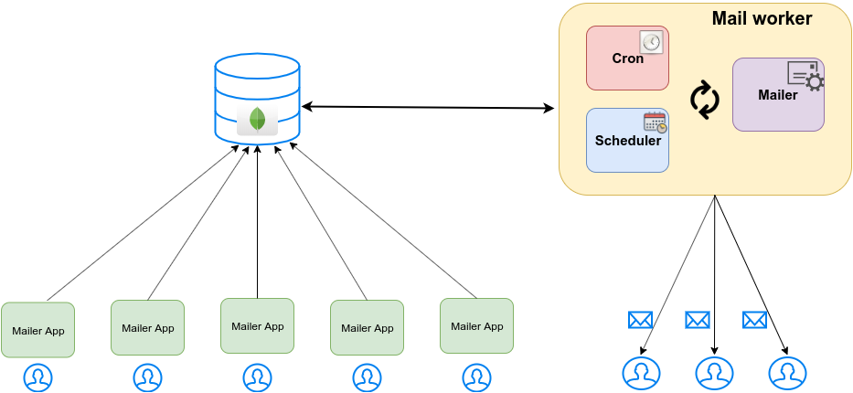
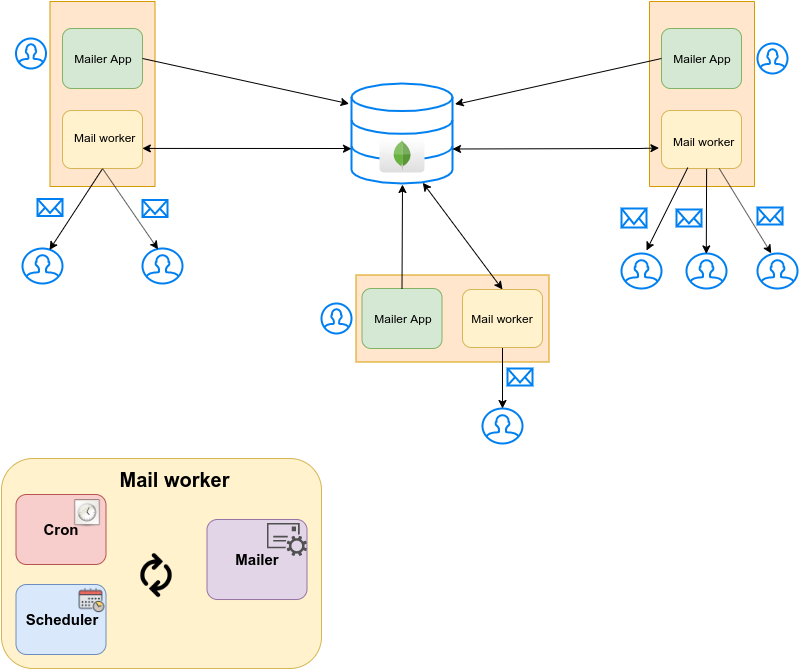

# mailer-worker

Mailer worker is a service which sends emails with [Mailgun](https://www.mailgun.com/) and offers a variety of scheduling options. This service should be running in background and *listen* for new emails. In order to use it you have to use your `API Key` and `Domain` from [Mailgun](https://www.mailgun.com/) which you will find in your account after a registration. As a next step you need to run [mailer-app](https://github.com/shterion/mailer-app) which is a client application that sends emails to an external storage.

---------
## Local installation
To run the service in background we recommend using [forever](https://www.npmjs.com/package/forever) module.
1. Run `npm install forever -g` - you could need `sudo` privileges
2. Clone the repository `git clone git@github.com:shterion/mailer-app.git`
3. In the **root** directory run `npm install` to install all dependencies
4. You should create a `.env` file in the **root** directory with the following variables:
- `DB_USERNAME` - your MongoDB username
- `DB_PASSWORD`- your MongoDB password
- `API_KEY`- your [Mailgun](https://www.mailgun.com/) `API Key`
- `DOMAIN`- your [Mailgun](https://www.mailgun.com/) `Domain`
- `APPLICATION_NAME` - application name is only used for a local  testing
> IMPORTANT: For local testing the `APPLICATION_NAME` variable in [mailer-app](https://github.com/shterion/mailer-app) **MUST** be the same as this one here. They have to be identical.   

5. In **root** directory run `forever start index.js`
6. The service should be running in background
7. To check its status, run `forever list`
8. To stop it - `forever stopall`

---------

## Architecture
The purpose of this service is to *listen* for new emails, then *schedule* the new ones and at the end to *send* them **now**, **later** or at **certain** time in the future with some **custom occurrence**. Three different modules are responsible for the whole process:
  1. **Cron** - its goal is to check if a new email has been stored in the database and if it founds some then it processes it to the next module
  2. **Mailer** - [Mailgun](https://www.mailgun.com/) comes into play to send the emails
  3. **Scheduler** - its purpose is to accept the email and schedule it with a certain **occurence**

### Production scenario
  

---------  

### Local scenario
To run **mailer-worker** and **mailer-app** locally you should have one instance from both of them and they **MUST** have the same `APPLICATION_NAME`.

## Functionality  

The application offers the following options for scheduling emails:  
  - **now**
  - **later** - on a specific date
  - **custom occurrence**
    - repeat - daily, weekly, monthly or yearly
    - ends - never, on(date), after(occurrences)

  ------------------------------------  

The service is deployed on [heroku](https://www.heroku.com/) using [Travis CI](https://travis-ci.com/shterion/mailer-worker).
